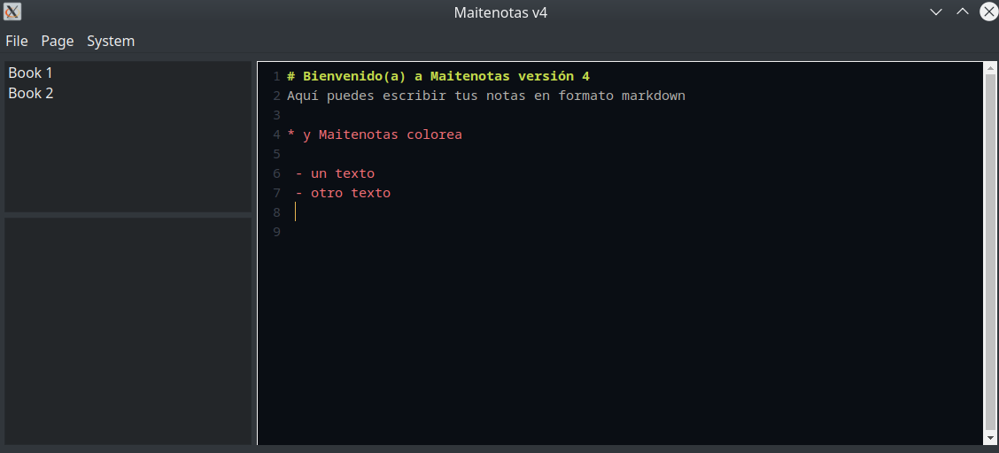

# maitenotas version 4

## Introduction

Little journal software to help you safely store (with encryption) important and personal text notes made with python and QT

## A screenshot (running in Windows, but can be compiled to run anywhere Python desktop software runs)

## License
GPL. It is free, open source, if you use any of this code keep your project also open source and keep all references to sources.
